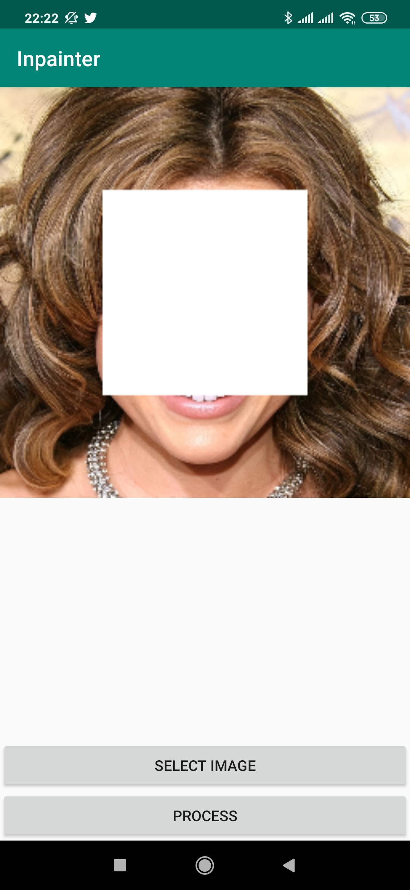
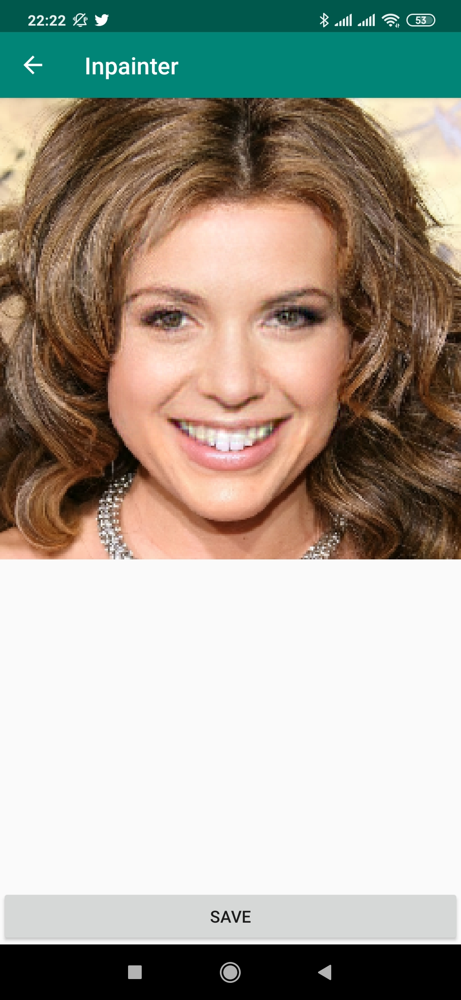
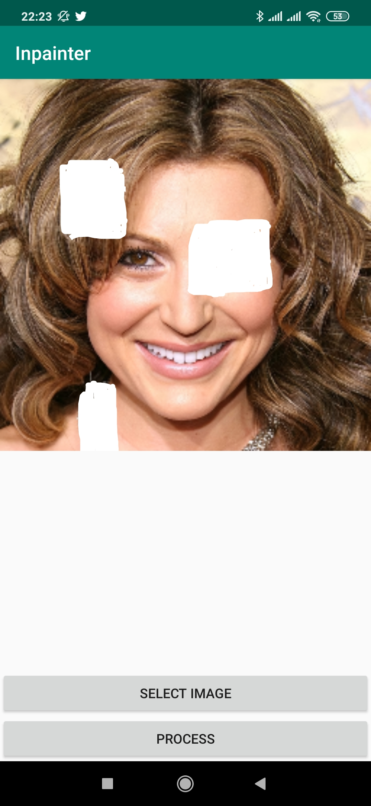
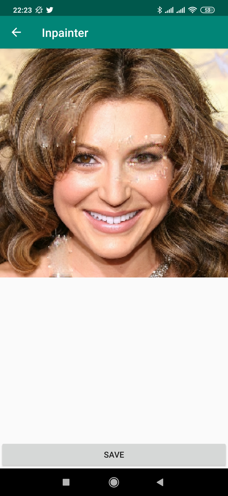
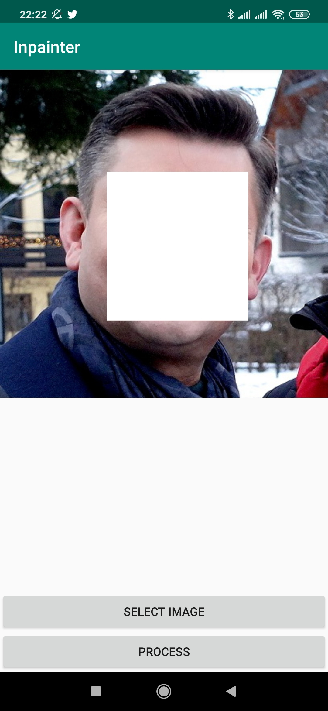
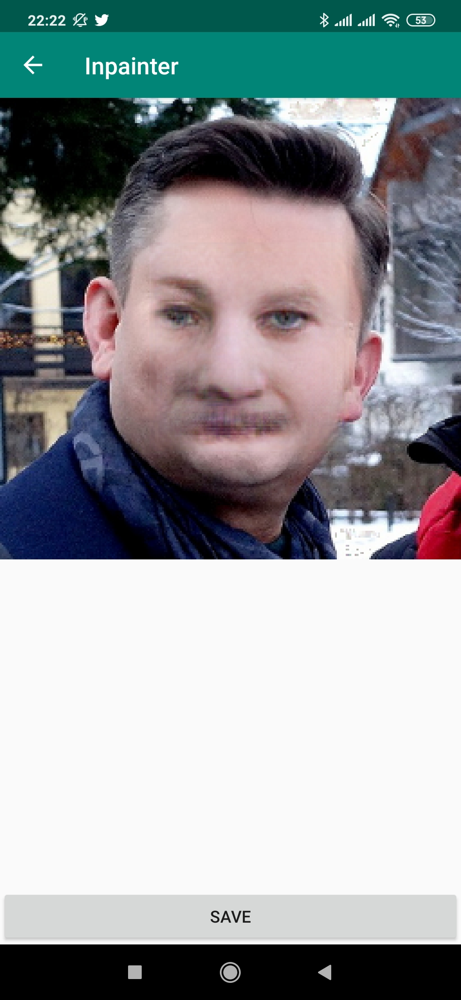
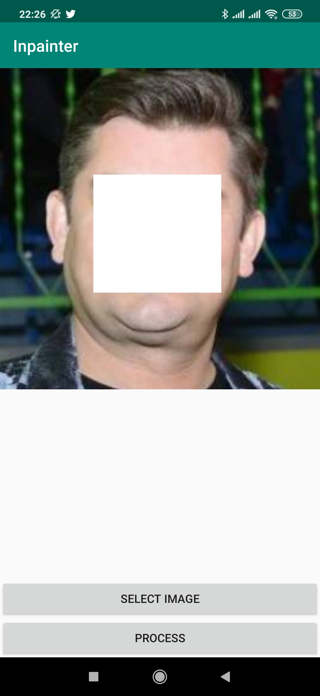
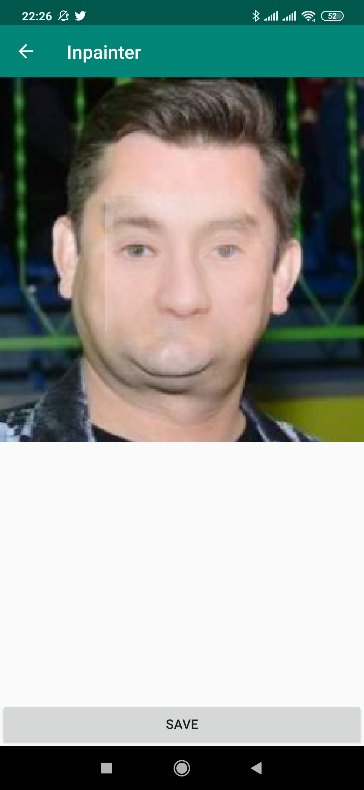

# Inpainter 🖌
A simple PoC Android application performing the task on inpainting on a given image. It accepts an image from your phone's gallery or a picture taken using the camera, allows you to paint over it, and then feeds the image through a neural network to fill the marked space.
It was trained specifically to perform the task on human faces.

## Results
Results for images similar to the training samples look relatively good.

  
   

  
   

For images differing more from the training dataset (be it in lightning, crop, perspective, quality etc.), the results are less perfect, and can even be quite creepy at times.

  
   

  
   

